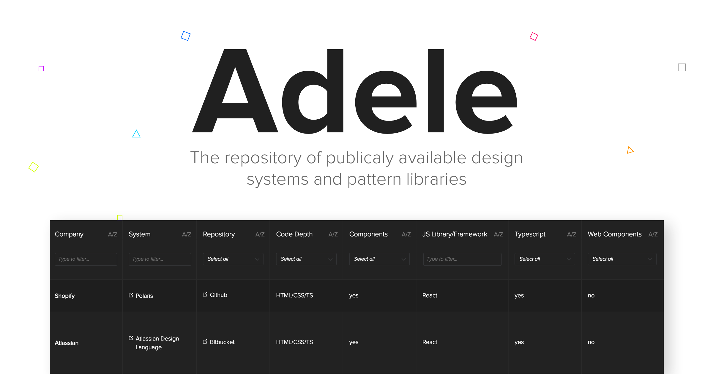

# Table of Contents

* [Introduction](#introduction)
* [Mission](#mission)
* [How to use?](#how-to-use)
* [Installation](#installation)
* [Contribution](#contribution)
  * [File Format](#file-format)
  * [Formatting](#formatting-rules)
    * [Categories Names](#categories-names)
    * [Data in Categories](#data-in-categories)
  * [How to add new system?](#how-to-add)
  * [How to change data about an existing system?](#how-to-change)
  * [How to add a new category?](#how-to-add-category)
  * [Tools](#tools)
    * [Build Data](#build-data)
    * [Generate Template](#generate-template)
    * [Re-build Data](#re-build-data)
* [Contributors](#contributors)
* [Why Adele?](#why-adele)
* [Why 'by UXPin'?](#why-uxpin)
* [Thank you!](#thank-you)

# Introduction

<a id='introduction'>

</a>


Adele is an open source repository of publicly available design systems and pattern libraries.

The creation of a design system and pattern library is a long, if not infinite, process that
requires a loooot of decisions. _Some_ of these decisions are about the structure and technology.
All are complex and have a huge impact on the future of design and development in our organizations.
No wonder that we, design system folks, battle imposter syndrome on daily basis 😱.

This is exactly why Adele is here. With dozens (hopefully soon hundreds!) of design systems and
pattern libraries analyzed, Adele serves as a reference point for all these decisions that we have
to make every day. Check what others do, learn from it and make better decisions about your own
system! 🚀

# Mission

<a id='mission'>

</a>

Adele is on a mission to collect _all_ the data about publicly available design systems and pattern
libraries and present it to the community in human (website) and computer (JSON) readable formats.

# How to use?

<a id='how-to-use'>

</a>

There are three ways to use Adele:

1. Browse data on [Adele's website](https://adele.uxpin.com). Take advantage of multiple filters and
   get to the right systems in no time ⚡️.
2. Browse data in
   [individual JSON files](https://github.com/marcintreder/adele/tree/master/src/data/systems) 🤖.
3. Browse data in
   [a common JSON file](https://github.com/marcintreder/adele/blob/master/src/data/data.JSON).
   _Why?_ Good question. Adele is an open source project, so you're free to take the data and use it
   in your own projects (contributing back to the design systems community - highly encouraged 👏).

# Installation
```
npm install
npm run serve
```

Then open http://localhost:8080/ to see the app.

# Contribution

<a id='contribution'>

</a>

Adele's mission is bold – collecting all the data about design systems / pattern libraries and
presenting it to the community in human and computer readable formats. While it was started by a
single human being and a single machine (well, except cloud servers), I'm hoping to welcome
contributors. What's impossible for a single human might be quite an easy task for a team! You are
all welcome to contribute! 🙏

## File format

<a id='file-format'>

</a>

Adele's JSON format is pretty straight-forward. Here's an example of a JSON file for a single
system:

```
{
  "company": {
    "data": "shopify",
    "label": "company"
  },
  "system": {
    "data": "polaris",
    "url": "https://polaris.shopify.com",
    "label": "system"
  },
  "repository": {
    "data": "Github",
    "url": "https://github.com/Shopify/polaris",
    "label": "repository"
  },
  "codeDepth": {
    "data": "HTML/CSS/TS",
    "label": "code depth"
  },
  "components": {
    "data": "yes",
    "label": "components"
  },
  "js": {
    "data": "React",
    "label": "JS library/framework"
  },
  "ts": {
    "data": "yes",
    "label": "Typescript"
  },
  "webComponents": {
    "data": "no",
    "label": "web components"
  },
  "tests": {
    "data": [
      "Jest",
      "Enzyme"
    ],
    "label": "tests"
  },
  "linter": {
    "data": [
      "ESLint",
      "TSLint"
    ],
    "label": "linter"
  },
  "css": {
    "data": [
      "Sass",
      "postCSS"
    ],
    "label": "CSS"
  },
  "cssInjs": {
    "data": "no",
    "label": "CSS in JS"
  },
  "designTokens": {
    "data": "no",
    "label": "design tokens"
  },
  "bundleManager": {
    "data": "Webpack",
    "label": "bundle manager"
  },
  "uiKit": {
    "data": "Sketch",
    "url": "https://github.com/Shopify/polaris/releases/download/v1.5.1/Sketch.UI.Kit.zip",
    "label": "UI kit"
  },
  "brandGuidelines": {
    "data": "no",
    "url": "",
    "label": "brand guidelines"
  },
  "colorPalette": {
    "data": "yes",
    "url": "https://polaris.shopify.com/visuals/colors",
    "label": "color palette"
  },
  "colorNaming": {
    "data": [
      "abstract (e.g. sky)",
      "natural (e.g. green)"
    ],
    "label": "color naming"
  },
  "contrastAnalysis": {
    "data": "yes",
    "url": "https://polaris.shopify.com/visuals/colors#section-accessibility",
    "label": "contrast analysis"
  },
  "typography": {
    "data": "yes",
    "url": "https://polaris.shopify.com/visuals/typography#navigation",
    "label": "typography"
  },
  "icons": {
    "data": "SVG",
    "url": "https://polaris.shopify.com/visuals/icons",
    "label": "icons"
  },
  "space/Grid": {
    "data": "yes",
    "url": "https://polaris.shopify.com/components/structure/layout#navigation",
    "label": "space / grid"
  },
  "illustrations": {
    "data": "yes",
    "url": "https://polaris.shopify.com/visuals/illustrations#navigation",
    "label": "illustration"
  },
  "dataVisualization": {
    "data": "yes",
    "url": "https://polaris.shopify.com/visuals/data-visualizations#navigation",
    "label": "data visualization"
  },
  "animation": {
    "data": "no",
    "url": "",
    "label": "animation"
  },
  "voiceTone": {
    "data": "yes",
    "url": "https://polaris.shopify.com/content/product-content",
    "label": "voice & tone"
  },
  "accessabilityGuidelines": {
    "data": "yes",
    "url": "https://polaris.shopify.com/principles/accessibility",
    "label": "accessability guidelines"
  },
  "designPrinciples": {
    "data": "yes",
    "url": "https://polaris.shopify.com/principles/principles",
    "label": "design principles"
  },
  "websiteDocumentation": {
    "data": "yes",
    "url": "https://polaris.shopify.com/components/get-started",
    "label": "documentation website"
  },
  "codeDocumentation": {
    "data": "Markdown",
    "url": "https://github.com/Shopify/polaris/tree/master/src/components/Card",
    "label": "code documentation"
  },
  "storybook": {
    "data": "no",
    "url": "",
    "label": "storybook"
  },
  "distribution": {
    "data": "npm",
    "label": "distribution"
  }
}
```

All the individual systems are connected into a common data.JSON file. This file is automatically
consumed by Adele's website (the table is automatically built based on this JSON).

## Formatting Rules

<a id='formating-rules'>

</a>

### Categories Names

<a id='categories-names'>

</a>

Categories names, for readability sake, should be expressed in a camelCase 🐫.

### Data in Categories

<a id='data-in-categories'>

</a>

Every category has to have two mandatory fields:

* `data` – representing the actual data visible in the table cell and used for all the analyses
* `label` – representing the header visible to users on Adele's website and one optional field:
* `url` – used as a source of a link added to `data`

Here are acceptable types of entries for every field:

| Field | Accepted Types           |
| ----- | ------------------------ |
| data  | string, array of strings |
| label | string                   |
| url   | string, array of strings |

Using an `array` in data and url automatically renders a list of links in the table on Adele's
website. **Note that the order matters.** The first string in the `data` array will get the link
from the first string in the `url` etc.

## How to add a new system?

<a id='how-to-add'>

</a>

First of all, thank you 👏 🙏. Secondly, the process of adding a new system is really easy:

1. Clone the Adele repo
2. `npm run template-build {company-name}` – it will automatically generate an empty JSON in the
   catalog src/data/systems. The file is going to have a name that you mentioned in the CLI (for
   clarity's sake let's keep it as the company name). If you haven't filled in the name, look for a
   file called '{creation-date}-new-system.JSON' and change its name to {creation-date}-{company}.JSON.
3. Fill in the empty JSON with the right data.
4. Compile the common data JSON (used by Adele's table on the website) by running `npm run
   data-build`. **Note: this will update the generated data.JSON file, so you may see an unexpected
   diff when you run `git status`. Don't worry about that!**
5. Test the Adele website by running `npm run serve` (if you don't see your system on the website,
   make sure you've saved data.JSON).
6. If everything is a-OK create a pull-request.

## How to change data about an existing system?

<a id='how-to-change'>

</a>

Thank you 👏 🙏 for taking the time to improve Adele's data. The process of changing the data is
simple!

1. Clone the Adele repo
2. Find the design system that you want to correct in src/data/systems.
3. Correct the data.
4. Compile the common data JSON (used by Adele's table on the website) by running `npm run
   data-build`.
5. Test Adele website by running `npm run serve` (if you don't see your system on the website,
   simply save data.JSON).
6. If everything is a-OK create a pull-request.

## How to add a new category?

<a id='how-to-add-category'>

</a>

Adele is extendable and you can feel free to add new categories to the table. If you add a new
category to any design system's JSON, Adele will add that same category to _every_ system. Note that
all the other systems will have 'no data' in the data field for that category. If you can fill it in
with the right data – great, if not, don't worry, the community (or I) will take care of it.

Follow steps from 'How to change data about an existing system?'.

## Tools

<a id='tools'>

</a>

Adele has couple of simple node.js tools aimed at helping with maintaining the whole project. Get to
know them below!

### Build Data

<a id='build-data'>

</a>

`npm run data-build` – this simple script takes data from individual JSON files and compiles them
into one common JSON file. Use it after every operation on data. Order of systems in data.json is based on the date of the creation of the file (automatically added to the files upon creation of the template e.g. `201801171632-dropbox.json`).

### Generate Template

<a id='generate-template'>

</a>

`npm run template-build {company-name}` – this script generates an empty JSON template. Use it
whenever you're adding a new system to Adele.

If the name of the company consists of more than one word use a hyphen. For example: `npm run
template-build {ge-digital}`. Please mind that the file name is going to have a creation date included e.g. `201801171632-ge-digital.json`.

### Re-build Data

<a id='re-build-data'>

</a>

`npm run data-rebuild {company-name}` – if something unexpected happens you can always quickly
rebuild the entire data set. Copy the content from data.JSON in the repo to
`src/data/data-safety-copy.jSON`, delete all the files from `src/data/systems` and run data-rebuild
command. It will automatically recreate all the individual system files.

# Contributors

<a id='contributors'>

</a>

Feel free to add yourself here if you have contributed to this project 🙏

* [Tali Marcus](https://github.com/talimarcus) – the first contributor 👑
* [Estelle Weyl](https://github.com/estelle)
* [Richard Bruskowski](https://github.com/richardbruskowski)
* [Kyle Gach](https://github.com/kylegach)
* [Dave Gillhespy](https://github.com/yodasw16)
* [Kaelig Deloumeau-Prigent](https://github.com/kaelig)
* [Michał Stocki](https://github.com/michalstocki)
* [Victor Valle Juarranz](https://github.com/victorvalle)
* [Waylon Baumgardner](https://github.com/waylonrobert)
* [Katie Riker](https://github.com/katierik)
* [Marianne Røsvik](https://github.com/mrosvik)
* [Caldis](https://github.com/Caldis)
* [Kristen Cooke](https://github.com/kriscooke)
* [Bartosz Dębicki](https://github.com/bdebicki)
* [Mike Perrotti](https://github.com/mperrotti)
* [Ben Anderson](https://github.com/banderson)
* [Pawel Neubauer](https://github.com/bauerpl)
* [Martin Wragg](https://github.com/mdwragg)
* [Chaunce 'Red' Dolan](https://github.com/reddolan)

# Why Adele?

<a id='why-adele'>

</a>

No. Adele – the Design Systems Repository, is not named after Adele – the singer. This is a tribute
to one of the most important computer scientists focused on graphic user interfaces, design patterns
and object-oriented programming – Adele Goldberg. Adele Goldberg worked at XEROX PARC in the 70s and
managed the System Concepts Laboratory where, together with Alan Kay and others, she developed
Smalltalk-80 – an object-oriented, dynamically typed programming language that was meant to power
"human-computer symbiosis".

Needless to say, SmallTalk also pioneered many concepts important to all modern design systems.
Objects in Smalltalk were easily transferable between applications and customizable. Smalltalk also
served as the foundation of PARC's work on graphically based user interfaces (many GUI concepts have
been developed by Adele Goldberg and her group!).

Thank you Adele!

# Why 'by UXPin'?

<a id='why-uxpin'>

</a>

Adele was started by Marcin Treder (that's me 👋 ) – coding designer, designing coder and CEO at
UXPin. Back in 2010, together with my dear co-founders, we started UXPin with the mission of
_merging_ design and development. The mission continues to this day!

UXPin sponsors Adele and my time spent on it, hence the 'by UXPin' in Adele's header.

If you want to say 'thank you 🙏', simply try our app at [UXPin.com](http://uxpin.com). And yes,
we're pretty good when it comes to design systems tooling 💥.

# Thank you!

<a id='thank-you'>

</a>

I'd like to thank the design systems community (👋
[Design Systems Slack](http://designsystems.herokuapp.com/) &
[Clarity Conference](https://www.clarityconf.com/)) and Alex Pate – the author of the very first
repository of systems –
[Awesome Design Systems](https://github.com/alexpate/awesome-design-systems). Thank you 🙌.
